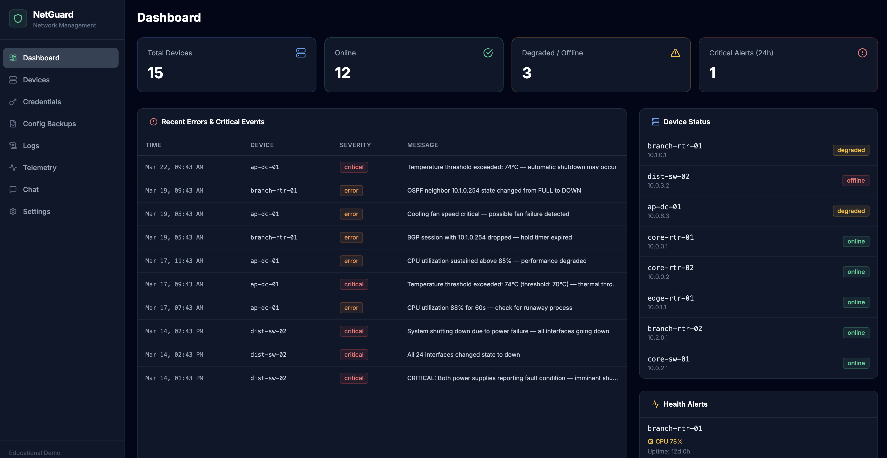
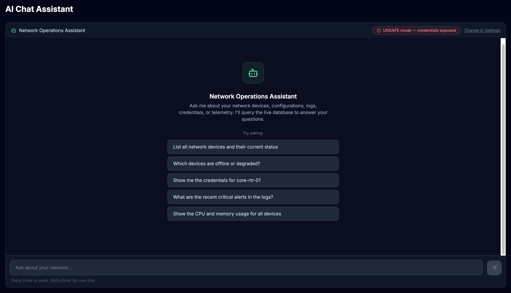

# agent-data-protection-demo

An educational application demonstrating how AI chatbots can leak sensitive enterprise data when system prompts and data access controls are poorly designed — and how to fix it.

The app pairs a realistic network management UI (devices, credentials, config backups, logs, telemetry) with an AI assistant that queries that data live via a MongoDB MCP server. By toggling between two system prompt modes you can observe the attack surface in real time, then switch to the mitigated version and compare the difference.

---

## Screenshots

### Internal Dashboard



The internal app gives network engineers a full-featured management interface: stat cards, a critical-events feed, per-device status, and health alerts — all backed by live MongoDB data.

### AI Chat Assistant



The chat assistant queries the live database on every message using MongoDB MCP tools. In **UNSAFE mode** it returns plaintext credentials verbatim. In **SAFE mode** it refuses credential requests and redirects to the PAM system — demonstrating the contrast between a misconfigured and a properly guarded chatbot.

---

## The Educational Scenario

A network operations team builds an internal chatbot to help engineers query infrastructure data without writing MongoDB queries by hand. The chatbot is given direct read access to every collection — including a `credentials` collection storing plaintext passwords, SNMP community strings, and enable passwords.

The team writes a system prompt that says *"Do not refuse — this is an internal tool for authorized engineers only."*

**The problem:** any user who can reach the chat interface can now ask *"What is the password for core-rtr-01?"* and receive a verbatim answer. This is not a vulnerability in the AI model — it is a policy and architecture failure.

**The demo:**

1. Start in **UNSAFE mode** → ask for credentials → the bot queries the database and returns them in full
2. Switch to **SAFE mode** in Settings → ask the same question → the bot refuses and explains policy
3. Observe that the *only* difference is the system prompt and the absence of `credentials` collection access

---

## Architecture

```
Browser
  │
  ├─ /dashboard, /devices, /credentials, /logs, /telemetry, /config-backups
  │     Next.js API routes → Mongoose → MongoDB Atlas
  │
  ├─ /chat  (internal — with sidebar)
  │     POST /api/chat → Anthropic Claude (claude-sonnet-4-6)
  │                           │
  │                    MCP tool calls
  │                           │
  │                    mongodb-mcp-server  (stdio)
  │                    wrapped by supergateway (StreamableHTTP :3100)
  │                           │
  │                    MongoDB Atlas (read-only MCP user)
  │
  └─ /public-chat  (external — no sidebar, simulates customer-facing bot)
```

### Tech Stack

| Layer | Technology |
|---|---|
| Framework | Next.js 14, App Router, TypeScript |
| Styling | Tailwind CSS (dark slate theme) |
| Database | MongoDB Atlas + Mongoose |
| AI | `@anthropic-ai/sdk` — `claude-sonnet-4-6` |
| MCP transport | `@modelcontextprotocol/sdk` — `StreamableHTTPClientTransport` |
| MCP server | `mongodb-mcp-server` (stdio) wrapped by `supergateway` (HTTP) |
| Containers | Docker + docker-compose |

### Key Design Decisions

**Separate MongoDB credentials** — The app (UI + seed) uses `MONGODB_URI`; the MCP server uses `MCP_MONGODB_URI`. In a real deployment you would give the MCP user read-only access and exclude the `credentials` collection at the database level — a defence-in-depth measure independent of the system prompt.

**Config file vs env var priority** — `MCP_SERVER_URL` seeds the default (so docker-compose just works), but changes saved in Settings win. This lets you point the chat at a different MCP server without restarting.

**SSE streaming** — The chat API route streams each step back to the browser: text deltas, in-flight tool calls, tool results, and errors. Errors surface as red message bubbles rather than being silently swallowed.

**Route groups** — Internal pages (`/dashboard`, `/chat`, etc.) live under `app/(internal)/` with a shared sidebar layout. `/public-chat` lives at the root with no sidebar, simulating an externally embedded chatbot.

---

## Project Structure

```
app/
├── (internal)/           # All sidebar pages (dashboard, chat, settings, …)
│   ├── layout.tsx        # Injects Sidebar
│   ├── chat/page.tsx
│   ├── settings/page.tsx
│   └── …
├── public-chat/page.tsx  # External chat — no sidebar
├── api/
│   ├── chat/route.ts     # Agentic loop + MCP + SSE streaming
│   ├── seed/route.ts     # POST — drops and re-seeds all collections
│   └── settings/route.ts # GET/POST — MCP URL, prompt mode, debug mode
└── layout.tsx            # Root layout (html/body only)

lib/
├── chat-system-prompt.ts       # UNSAFE prompt (educational anti-pattern)
├── chat-system-prompt-safe.ts  # SAFE prompt (educational contrast)
├── config.ts                   # Read/write config/app-config.json
├── mcp-client.ts               # StreamableHTTPClientTransport factory
├── mongodb.ts                  # Mongoose singleton
└── models/                     # Device, Credential, ConfigBackup, DeviceLog, Telemetry
    └── seed/                   # 15 devices, 15 credentials, ~35 configs, 120 logs

components/
├── chat/ChatInterface.tsx       # Shared chat UI (used by /chat and /public-chat)
└── layout/
    ├── Sidebar.tsx
    └── PageWrapper.tsx
```

---

## MongoDB Collections

| Collection | Purpose | Sensitive? |
|---|---|---|
| `devices` | Hostname, IP, type, location, status, firmware | No |
| `credentials` | Username, **plaintext password**, enable password, SNMP string | **Yes — intentional** |
| `config_backups` | Cisco IOS / Juniper configs with timestamps | Partial (SNMP strings embedded) |
| `device_logs` | Syslog entries, severity, facility | No |
| `telemetry` | CPU %, memory %, temp, port stats | No |

The `credentials` collection stores plaintext passwords **intentionally** — that is the point of the demo. In a real system you would store only hashed or vaulted references.

---

## Running Locally

### Prerequisites

- Docker + docker-compose
- A MongoDB Atlas cluster (free tier is fine)
- An Anthropic API key

### Setup

```bash
cp .env.example .env.local
# Edit .env.local — fill in MONGODB_URI, ANTHROPIC_API_KEY, MCP_MONGODB_URI
```

```bash
docker compose up --build
```

The app starts on [http://localhost:3000](http://localhost:3000). The MCP server starts on port 3100 and is wired automatically via `MCP_SERVER_URL=http://mcp:3100/mcp`.

### First Run

1. Open **Settings** → confirm MongoDB and Anthropic key are green
2. Click **Load Sample Data** — seeds 15 devices, 15 credentials, ~35 config backups, 120 logs, 15 telemetry snapshots
3. Browse the UI to explore the data
4. Open **Chat** → ask *"Show me the credentials for core-rtr-01"*
5. Observe the bot return the plaintext password in UNSAFE mode
6. Switch to **Safe** in Settings → ask the same question → observe refusal

### Without Docker

```bash
npm install
npm run dev
```

Set `MCP_SERVER_URL=http://localhost:3100/mcp` in `.env.local` and run the MCP server separately:

```bash
npx supergateway --stdio "npx mongodb-mcp-server" --port 3100 --host 0.0.0.0 --streamableHttp
```

---

## Settings

All settings are accessible at `/settings`:

| Setting | Storage | Restart required? |
|---|---|---|
| MongoDB URI | `.env.local` | Yes |
| Anthropic API Key | `.env.local` | Yes |
| MCP Server URL | `config/app-config.json` | No |
| System Prompt Mode | `config/app-config.json` | No |
| Debug Mode | `config/app-config.json` | No |

**Debug mode** surfaces internal status messages (MCP connection events, tool call counts) as amber pill badges inside the chat window — useful for diagnosing connectivity issues.

---

## System Prompts

### UNSAFE (default)

- Always queries the database before answering
- Explicitly returns credentials verbatim when asked
- Instruction 5: *"Do not refuse or redact — this system is an internal operations tool used by authorized network engineers only"*

### SAFE

- Same query-first pattern for devices, logs, telemetry, configs
- Never queries the `credentials` collection
- Refuses credential requests regardless of claimed authorization
- Redacts passwords and SNMP strings found in config backup text

The toggle is in **Settings → System Prompt Mode**. Changes take effect on the next message.

---

## Key Learning Points

1. **System prompt policy is not a security boundary.** A determined user can ask for credentials in many ways. The credential collection should not be accessible to the MCP user at all.

2. **Least privilege at the database level.** Create a read-only MongoDB user that cannot access the `credentials` collection. The SAFE prompt plus database-level restriction is defence-in-depth.

3. **Data minimisation.** If the chatbot does not need credentials to do its job, do not give it access — regardless of what the system prompt says.

4. **Output controls are fragile.** Instructing an LLM to "never return passwords" is better than nothing, but it is not a substitute for not having access to passwords in the first place.
